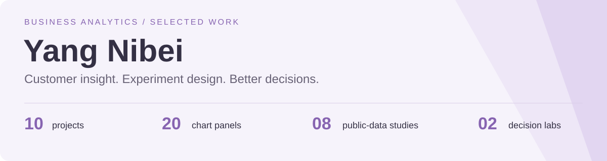

# Hi, I'm Yang Nibei

I explore how data can support better business decisions—from understanding customers to evaluating experiments and planning operations.

**Python · SQL · Statistical analysis · Forecasting · Decision modelling**

[Selected work](#selected-work) · [All 10 projects](#project-directory) · [How to read this portfolio](#how-to-read-this-portfolio)

## Selected work

<table>
<tr>
<td width="50%" valign="top">

### Understand customers

**[Customer Segmentation · RFM](https://github.com/yangnibei/customer-segmentation-rfm)**

Turn purchase histories into clear customer groups and testable retention ideas.

*4,338 identified customers · transparent segmentation*

</td>
<td width="50%" valign="top">

### Plan with uncertainty

**[Demand Forecasting](https://github.com/yangnibei/demand-forecasting)**

Compare one-day-ahead rental forecasts with a simple seasonal baseline.

*120-day chronological holdout · baseline comparison*

</td>
</tr>
</table>

## Project directory

### 01 / Customer & growth

| Project | Business question | Analytical focus |
| :--- | :--- | :--- |
| **[01 · Retail Performance](https://github.com/yangnibei/retail-performance)** | Where does sales value come from, and how do cancellations change the picture? | SQL aggregation, revenue reconciliation, monthly trends |
| **[02 · Customer Segmentation · RFM](https://github.com/yangnibei/customer-segmentation-rfm)** | Which observed customers should receive different relationship-management strategies? | Recency-frequency-monetary segmentation, concentration analysis |
| **[03 · Cohort Retention](https://github.com/yangnibei/cohort-retention)** | Do first-observed customer groups return in subsequent months? | Monthly acquisition cohorts, repeat-purchase heatmap, censoring |
| **[09 · Wholesale Customer Segments](https://github.com/yangnibei/wholesale-customer-segments)** | Can spending patterns support differentiated B2B account propositions? | Log transformation, K-means, silhouette comparison |

### 02 / Marketing & experiments

| Project | Business question | Analytical focus |
| :--- | :--- | :--- |
| **[04 · Campaign Targeting](https://github.com/yangnibei/campaign-targeting)** | Can a pre-contact score prioritise a limited call budget? | Chronological holdout, logistic regression, precision and lift |
| **[05 · Shopping Conversion](https://github.com/yangnibei/shopping-conversion)** | Which session segments show conversion gaps worth investigating? | Wilson confidence intervals, visitor and traffic segmentation |
| **[06 · A/B Testing Lab](https://github.com/yangnibei/ab-testing-lab)** | Would a simulated checkout experiment justify a rollout? | Randomised simulation, sample-ratio check, confidence interval, power planning · **Synthetic** |

### 03 / Operations & decisions

| Project | Business question | Analytical focus |
| :--- | :--- | :--- |
| **[07 · Demand Forecasting](https://github.com/yangnibei/demand-forecasting)** | Can yesterday's information improve next-day bike rental forecasts? | Rolling-origin features, chronological evaluation, seasonal baseline |
| **[08 · Inventory Prioritisation](https://github.com/yangnibei/inventory-prioritisation)** | Which products deserve planning attention based on unit volume and demand variability? | ABC-XYZ segmentation, 40/12-week temporal holdout |
| **[10 · Pricing Scenario Lab](https://github.com/yangnibei/pricing-scenario-lab)** | How sensitive is contribution profit to price and demand assumptions? | Constant-elasticity scenarios, break-even economics, sensitivity analysis · **Assumption-driven** |

## How to read this portfolio

**Start with the question → inspect the results → review the assumptions → run the code.**

Every project includes an English brief, reproducible Python code, a generated visual, machine-readable metrics, source attribution and explicit limitations. Where relevant, models are compared with baselines on held-out data.

- **8 public-data case studies:** historical UCI datasets, with original attribution and source hashes. Three retail studies use the same source to answer distinct questions.
- **2 decision labs:** A/B testing uses simulated visitors; pricing uses assumed demand and cost scenarios. Neither represents measured business impact.
- **Transparent scope:** educational portfolio work developed with AI assistance. No invented clients, job titles, commercial results or production-deployment claims.

Yang Nibei · Business Analytics Portfolio · Built around questions, evidence and decisions.

