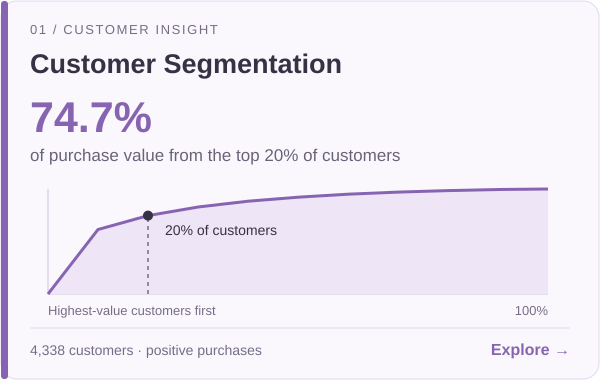
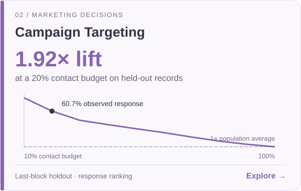
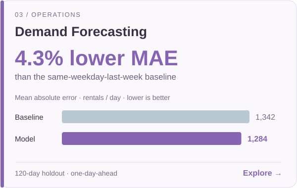
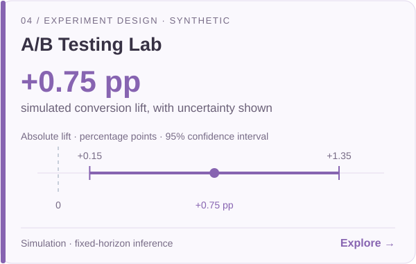

I use data to explore how businesses understand customers, evaluate experiments and plan operations.

**Python · SQL · Statistical analysis · Forecasting · Decision modelling**

[Explore selected projects](#selected-projects) · [Browse all 10](#all-projects) · [Methods & evidence](#methods--evidence)

## Selected projects

Four starting points across customer insight, marketing, operations and experimentation. **Click a card to open the full case study.**

<table>
<tr>
<td width="50%" valign="top">

</td>
<td width="50%" valign="top">

</td>
</tr>
<tr>
<td width="50%" valign="top">

</td>
<td width="50%" valign="top">

</td>
</tr>
</table>

Card figures summarise the reproducible results in each linked repository. Public-data findings are historical and observational; the experiment card is explicitly synthetic.

## All projects

### Customer & growth

| Case study | Decision explored |
| :--- | :--- |
| **[01 · Retail Performance](https://github.com/yangnibei/retail-performance)** | Reconcile gross sales, negative adjustments and net sales across time and markets. |
| **[02 · Customer Segmentation · RFM](https://github.com/yangnibei/customer-segmentation-rfm)** | Identify customer groups and examine how purchase value is concentrated. |
| **[03 · Cohort Retention](https://github.com/yangnibei/cohort-retention)** | Compare repeat purchasing at equal cohort maturity, with eligible customer bases. |
| **[09 · Wholesale Customer Segments](https://github.com/yangnibei/wholesale-customer-segments)** | Explore B2B spending profiles using clustering and indexed category comparisons. |

### Marketing & experiments

| Case study | Decision explored |
| :--- | :--- |
| **[04 · Campaign Targeting](https://github.com/yangnibei/campaign-targeting)** | Evaluate response ranking as the contact budget expands, using a last-block holdout. |
| **[05 · Shopping Conversion](https://github.com/yangnibei/shopping-conversion)** | Investigate visitor and traffic conversion differences with confidence intervals. |
| **[06 · A/B Testing Lab](https://github.com/yangnibei/ab-testing-lab)** | Interpret effect uncertainty and plan sample size. **Synthetic experiment.** |

### Operations & decisions

| Case study | Decision explored |
| :--- | :--- |
| **[07 · Demand Forecasting](https://github.com/yangnibei/demand-forecasting)** | Compare rolling next-day predictions and error patterns with a seasonal baseline. |
| **[08 · Inventory Prioritisation](https://github.com/yangnibei/inventory-prioritisation)** | Connect ABC–XYZ planning groups with volume concentration and forecast errors. |
| **[10 · Pricing Scenario Lab](https://github.com/yangnibei/pricing-scenario-lab)** | Explore profit sensitivity and grid-best prices. **Assumption-driven simulation.** |

## Methods & evidence

**Business question → analysis → visual evidence → decision boundaries**

Every project includes a business brief, runnable Python code, two analytical panels, a results report, machine-readable metrics and source attribution.

| Area | Demonstrated methods |
| :--- | :--- |
| Data preparation | Python, pandas, SQL aggregation, input checks and revenue reconciliation |
| Customer & marketing analysis | RFM, cohort retention, logistic regression, precision and lift |
| Statistical reasoning | Confidence intervals, randomisation checks and sample-size planning |
| Operational decisions | Forecast baselines, chronological evaluation, ABC–XYZ and scenario analysis |

<b>Reproducibility, data sources and scope</b>

- **8 public-data case studies:** historical UCI datasets with source attribution and archive hashes. Three retail studies use the same source for distinct questions.
- **2 decision labs:** A/B testing uses simulated visitors; pricing uses assumed demand and costs. Neither represents measured commercial impact.
- **Reproduce a result:** open a project, follow its README, then inspect `REPORT.md`, `results.json` and `analysis.py`.
- **Scope:** educational portfolio projects developed with AI assistance. Findings are presented with their assumptions and limitations.

Yang Nibei · Business Analytics Portfolio
